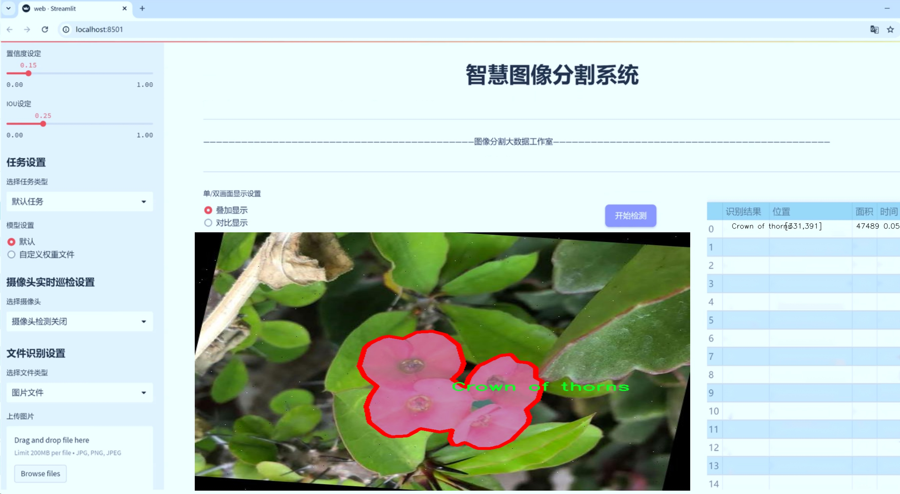
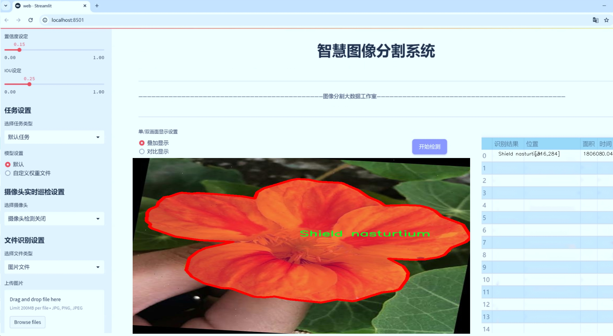
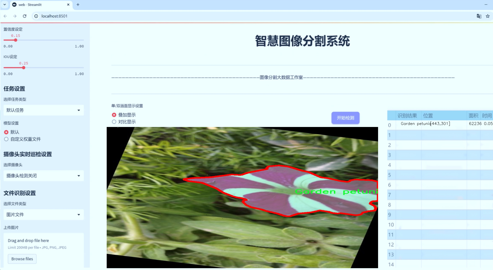
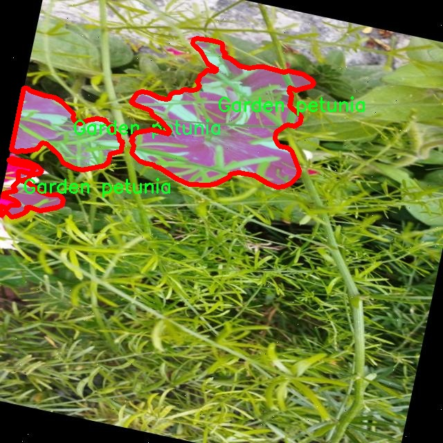
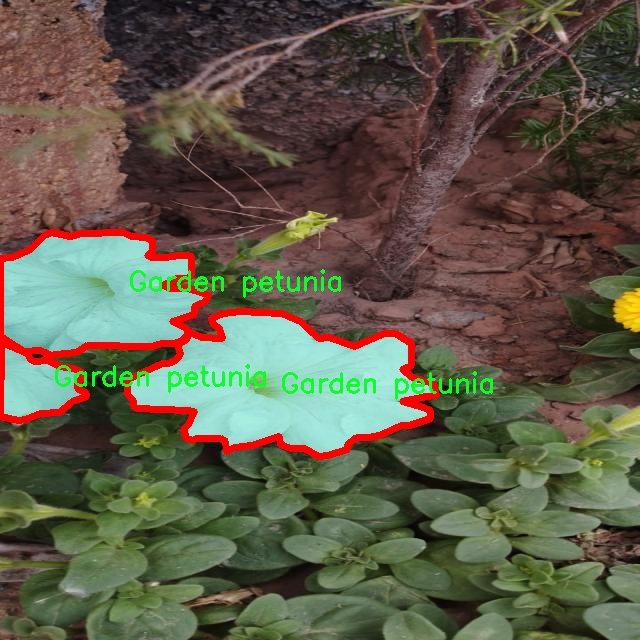
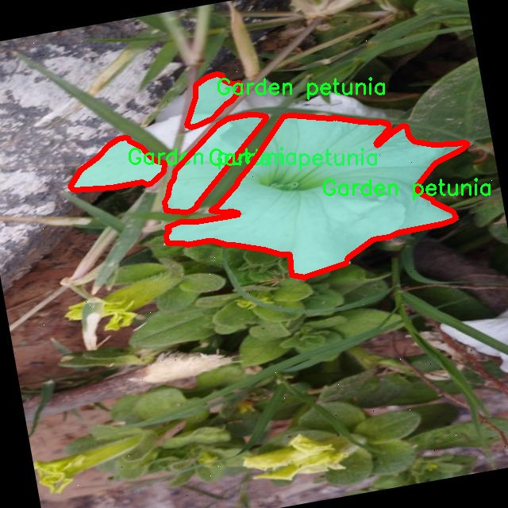
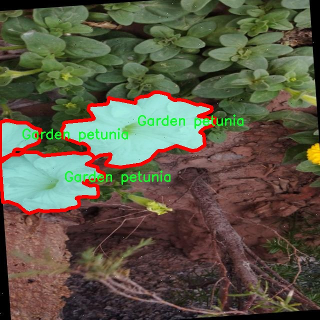
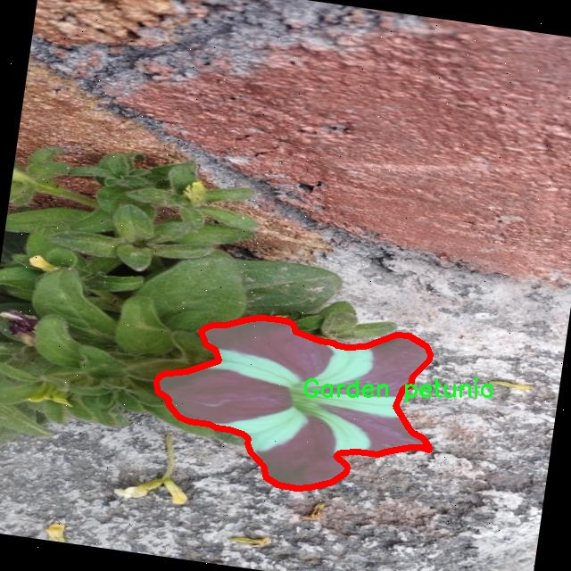

# 花卉图像分割系统： yolov8-seg-dyhead-DCNV3

### 1.研究背景与意义

[参考博客](https://gitee.com/YOLOv8_YOLOv11_Segmentation_Studio/projects)

[博客来源](https://kdocs.cn/l/cszuIiCKVNis)

研究背景与意义

随着计算机视觉技术的快速发展，图像分割作为其中的重要任务之一，已经在多个领域中得到了广泛应用，尤其是在农业、生态监测和园艺等领域。花卉图像分割不仅可以帮助研究人员更好地理解植物的生长特性，还能为园艺设计、植物识别和病虫害监测提供重要支持。近年来，深度学习技术的进步，尤其是YOLO（You Only Look Once）系列模型的出现，使得图像分割的精度和效率得到了显著提升。YOLOv8作为该系列的最新版本，凭借其高效的特征提取能力和实时处理能力，成为了图像分割任务中的热门选择。

本研究旨在基于改进的YOLOv8模型，构建一个高效的花卉图像分割系统。所使用的数据集包含1800张花卉图像，涵盖了六个不同的花卉类别，包括加利福尼亚脆枝灌木、荆棘花、花园矮牵牛、麝香玫瑰、朝鲜蓟和盾形旱金莲。这些花卉的多样性为模型的训练和评估提供了丰富的样本，有助于提高模型的泛化能力和鲁棒性。通过对这些花卉图像的精确分割，研究者可以更深入地分析不同花卉的形态特征、生态适应性以及生长环境的影响。

在当前的研究背景下，花卉图像分割面临着许多挑战。首先，花卉的形态和颜色变化多样，光照条件和背景环境的差异也会对分割效果产生影响。其次，传统的图像分割方法往往难以处理复杂的场景，容易出现分割不准确或漏分的情况。因此，基于深度学习的改进YOLOv8模型，能够通过学习大量的图像特征，自动提取花卉的边界和形状，从而实现更为精准的分割。

本研究的意义在于，通过改进YOLOv8模型，不仅可以提升花卉图像分割的准确性和效率，还能够为相关领域的研究提供有力的技术支持。具体而言，准确的花卉图像分割可以为植物分类、物种识别和生态监测提供基础数据，进而推动生物多样性保护和生态环境的可持续发展。此外，该系统的成功应用还可以为智能农业和精准园艺提供数据支持，帮助农民和园艺师更好地管理作物，提高产量和质量。

综上所述，基于改进YOLOv8的花卉图像分割系统不仅具有重要的理论价值，还有着广泛的实际应用前景。通过深入研究和开发该系统，能够为花卉图像处理领域的技术进步贡献力量，同时也为相关学科的交叉研究提供新的思路和方法。

### 2.图片演示







注意：本项目提供完整的训练源码数据集和训练教程,由于此博客编辑较早,暂不提供权重文件（best.pt）,需要按照6.训练教程进行训练后实现上图效果。

### 3.视频演示

[3.1 视频演示](https://www.bilibili.com/video/BV1ApBXYpEcC/)

### 4.数据集信息

##### 4.1 数据集类别数＆类别名

nc: 6
names: ['California brittlebush', 'Crown of thorns', 'Garden petunia', 'Musk Rose', 'Peregrina', 'Shield nasturtium']


##### 4.2 数据集信息简介

数据集信息展示

在现代计算机视觉领域，图像分割技术正日益成为一种重要的研究方向，尤其是在植物分类和识别的应用中。为了有效地训练和改进YOLOv8-seg模型，我们采用了名为“Flowerss”的数据集，该数据集专门用于花卉图像的分割任务。通过对这一数据集的深入分析，我们可以更好地理解其在模型训练中的重要性和应用潜力。

“Flowerss”数据集包含六个不同的花卉类别，具体包括：加利福尼亚脆枝灌木（California brittlebush）、荆棘花（Crown of thorns）、花园波斯菊（Garden petunia）、麝香玫瑰（Musk Rose）、佩雷格里纳（Peregrina）和盾形旱金莲（Shield nasturtium）。这些类别不仅在视觉特征上具有显著的差异性，而且在生态环境和生长习性上也各具特色，为模型的学习提供了丰富的样本。

数据集中的每个类别均包含大量高质量的图像，这些图像经过精心标注，确保了每个花卉的轮廓和细节都得到了准确的描绘。这种高质量的标注对于YOLOv8-seg模型的训练至关重要，因为它能够帮助模型学习到更为细致的特征，从而在实际应用中实现更高的分割精度。通过对这些花卉图像的分析，模型不仅能够识别出花卉的种类，还能准确地分割出花卉的各个部分，例如花瓣、叶子和茎等。

在数据集的构建过程中，特别注重了图像的多样性和代表性。每个类别的图像均来自不同的拍摄环境和光照条件，这使得模型在训练时能够接触到各种可能的场景变化，从而提高其泛化能力。例如，加利福尼亚脆枝灌木的图像可能在阳光明媚的环境中拍摄，而荆棘花的图像则可能是在阴影下拍摄。这种多样性不仅增强了数据集的实用性，也为模型在实际应用中的表现奠定了基础。

此外，数据集还考虑到了不同花卉的生长阶段和状态，包括盛开的花朵、含苞待放的花蕾以及枯萎的花瓣等。这种多样化的样本选择使得模型能够更全面地理解花卉的特征变化，进而在实际应用中更好地应对不同的识别和分割任务。

总之，“Flowerss”数据集为改进YOLOv8-seg的花卉图像分割系统提供了丰富而多样的训练素材。通过对这一数据集的充分利用，我们期待能够提升模型在花卉识别和分割任务中的表现，进而推动计算机视觉技术在植物科学和生态保护等领域的应用。随着研究的深入，我们相信这一数据集将为相关领域的学术研究和实际应用提供重要的支持和参考。











### 5.项目依赖环境部署教程（零基础手把手教学）

[5.1 环境部署教程链接（零基础手把手教学）](https://www.bilibili.com/video/BV1jG4Ve4E9t/?vd_source=bc9aec86d164b67a7004b996143742dc)


[5.2 安装Python虚拟环境创建和依赖库安装视频教程链接（零基础手把手教学）](https://www.bilibili.com/video/BV1nA4VeYEze/?vd_source=bc9aec86d164b67a7004b996143742dc)

### 6.手把手YOLOV8-seg训练视频教程（零基础手把手教学）

[6.1 手把手YOLOV8-seg训练视频教程（零基础小白有手就能学会）](https://www.bilibili.com/video/BV1cA4VeYETe/?vd_source=bc9aec86d164b67a7004b996143742dc)


按照上面的训练视频教程链接加载项目提供的数据集，运行train.py即可开始训练



     Epoch   gpu_mem       box       obj       cls    labels  img_size
     1/200     0G   0.01576   0.01955  0.007536        22      1280: 100%|██████████| 849/849 [14:42<00:00,  1.04s/it]
               Class     Images     Labels          P          R     mAP@.5 mAP@.5:.95: 100%|██████████| 213/213 [01:14<00:00,  2.87it/s]
                 all       3395      17314      0.994      0.957      0.0957      0.0843

     Epoch   gpu_mem       box       obj       cls    labels  img_size
     2/200     0G   0.01578   0.01923  0.007006        22      1280: 100%|██████████| 849/849 [14:44<00:00,  1.04s/it]
               Class     Images     Labels          P          R     mAP@.5 mAP@.5:.95: 100%|██████████| 213/213 [01:12<00:00,  2.95it/s]
                 all       3395      17314      0.996      0.956      0.0957      0.0845

     Epoch   gpu_mem       box       obj       cls    labels  img_size
     3/200     0G   0.01561    0.0191  0.006895        27      1280: 100%|██████████| 849/849 [10:56<00:00,  1.29it/s]
               Class     Images     Labels          P          R     mAP@.5 mAP@.5:.95: 100%|███████   | 187/213 [00:52<00:00,  4.04it/s]
                 all       3395      17314      0.996      0.957      0.0957      0.0845


### 7.50+种全套YOLOV8-seg创新点加载调参实验视频教程（一键加载写好的改进模型的配置文件）

[7.1 50+种全套YOLOV8-seg创新点加载调参实验视频教程（一键加载写好的改进模型的配置文件）](https://www.bilibili.com/video/BV1Hw4VePEXv/?vd_source=bc9aec86d164b67a7004b996143742dc)

### YOLOV8-seg算法简介

原始YOLOv8-seg算法原理

YOLOv8-seg算法是YOLO系列目标检测模型的最新进展，基于YOLOv5的架构进行了优化与升级，特别是在目标分割任务上展现了更为卓越的性能。该算法的设计理念旨在实现高效的目标检测与分割，尤其是在复杂背景下的小目标检测中，YOLOv8-seg通过引入多种创新机制来提升模型的准确性和鲁棒性。

首先，YOLOv8-seg的网络结构主要由三个核心部分组成：骨干特征提取网络、特征融合层和检测头层。骨干网络的设计采用了轻量化的C2F模块，这一模块的引入不仅减轻了计算负担，还提高了特征提取的效率。C2F模块通过使用3×3的卷积核和深度可分离卷积的策略，显著降低了模型的参数量，同时保持了特征提取的精度。这种轻量化设计使得YOLOv8-seg能够在资源受限的环境中高效运行，适应各种硬件平台。

在特征融合层，YOLOv8-seg结合了特征金字塔网络（FPN）和路径聚合网络（PAN）的优势，通过双向跨尺度连接和加权特征融合，进一步提升了对不同尺度特征信息的提取能力。特征金字塔网络通过构建多层次的特征图，能够有效地捕捉到图像中的细节信息，而路径聚合网络则通过优化特征传递路径，增强了特征的表达能力。值得注意的是，YOLOv8-seg还引入了BiFPN网络，这一创新的设计使得特征融合过程更加高效，能够在不同尺度间快速地传递信息，从而提升了模型的整体性能。

检测头层采用了轻量化的解耦头结构，这一结构的设计理念是将目标分类与边界框回归任务进行解耦处理，从而提高了模型的训练效率和检测精度。通过将分类和回归任务分开，YOLOv8-seg能够更好地优化每个任务的损失函数，进而提升模型在复杂场景下的表现。此外，YOLOv8-seg采用了无锚点检测方法，这一方法相较于传统的锚点检测方法，能够在小目标检测中表现出更高的灵活性和准确性。

在模型的训练过程中，YOLOv8-seg使用了多种数据增强技术，包括Mosaic数据增强、自适应图片缩放和灰度填充等。这些技术的应用不仅丰富了训练数据的多样性，还有效地提高了模型的泛化能力，使其在面对不同类型的输入时，能够保持较高的检测精度。同时，YOLOv8-seg还采用了Task-Aligned Assigner方法，通过对分类分数和回归分数进行加权，优化了正样本的匹配过程，进一步提升了模型的训练效果。

YOLOv8-seg在损失计算方面也进行了创新，采用了BCE（Binary Cross-Entropy）损失函数来计算分类损失，同时使用DFL（Distribution Focal Loss）和CIoU（Complete Intersection over Union）损失函数来计算回归损失。这种多损失函数的设计使得模型在训练过程中能够更好地平衡分类与回归任务的优化，进而提升了模型的整体性能。

此外，YOLOv8-seg在处理复杂背景和小目标时，特别注重上下文信息的保留。为此，模型引入了BiFormer双层路由注意力机制，构建了C2fBF模块，以捕获远程依赖关系。这一机制的引入，使得模型在特征提取过程中能够保留更细粒度的上下文信息，从而有效提升了对小目标的感知能力。

总的来说，YOLOv8-seg算法通过多种创新设计与优化策略，成功地提升了目标检测与分割的性能。其轻量化的网络结构、高效的特征融合机制以及灵活的损失计算方法，使得YOLOv8-seg在处理复杂场景和小目标时展现出了卓越的能力。随着YOLOv8-seg的不断发展与完善，预计将在更多实际应用中发挥重要作用，推动目标检测与分割技术的进一步进步。


### 9.系统功能展示（检测对象为举例，实际内容以本项目数据集为准）

图9.1.系统支持检测结果表格显示

  图9.2.系统支持置信度和IOU阈值手动调节

  图9.3.系统支持自定义加载权重文件best.pt(需要你通过步骤5中训练获得)

  图9.4.系统支持摄像头实时识别

  图9.5.系统支持图片识别

  图9.6.系统支持视频识别

  图9.7.系统支持识别结果文件自动保存

  图9.8.系统支持Excel导出检测结果数据


### 10.50+种全套YOLOV8-seg创新点原理讲解（非科班也可以轻松写刊发刊，V11版本正在科研待更新）

#### 10.1 由于篇幅限制，每个创新点的具体原理讲解就不一一展开，具体见下列网址中的创新点对应子项目的技术原理博客网址【Blog】：


[10.1 50+种全套YOLOV8-seg创新点原理讲解链接](https://gitee.com/qunmasj/good)

#### 10.2 部分改进模块原理讲解(完整的改进原理见上图和技术博客链接)【如果此小节的图加载失败可以通过CSDN或者Github搜索该博客的标题访问原始博客，原始博客图片显示正常】
### YOLOv8简介
#### Backbone


借鉴了其他算法的这些设计思想

借鉴了VGG的思想，使用了较多的3×3卷积，在每一次池化操作后，将通道数翻倍；

借鉴了network in network的思想，使用全局平均池化（global average pooling）做预测，并把1×1的卷积核置于3×3的卷积核之间，用来压缩特征；（我没找到这一步体现在哪里）

使用了批归一化层稳定模型训练，加速收敛，并且起到正则化作用。

    以上三点为Darknet19借鉴其他模型的点。Darknet53当然是在继承了Darknet19的这些优点的基础上再新增了下面这些优点的。因此列在了这里

借鉴了ResNet的思想，在网络中大量使用了残差连接，因此网络结构可以设计的很深，并且缓解了训练中梯度消失的问题，使得模型更容易收敛。

使用步长为2的卷积层代替池化层实现降采样。（这一点在经典的Darknet-53上是很明显的，output的长和宽从256降到128，再降低到64，一路降低到8，应该是通过步长为2的卷积层实现的；在YOLOv8的卷积层中也有体现，比如图中我标出的这些位置）

#### 特征融合

模型架构图如下

  Darknet-53的特点可以这样概括：（Conv卷积模块+Residual Block残差块）串行叠加4次

  Conv卷积层+Residual Block残差网络就被称为一个stage


上面红色指出的那个，原始的Darknet-53里面有一层 卷积，在YOLOv8里面，把一层卷积移除了

为什么移除呢？

        原始Darknet-53模型中间加的这个卷积层做了什么？滤波器（卷积核）的个数从 上一个卷积层的512个，先增加到1024个卷积核，然后下一层卷积的卷积核的个数又降低到512个

        移除掉这一层以后，少了1024个卷积核，就可以少做1024次卷积运算，同时也少了1024个3×3的卷积核的参数，也就是少了9×1024个参数需要拟合。这样可以大大减少了模型的参数，（相当于做了轻量化吧）

        移除掉这个卷积层，可能是因为作者发现移除掉这个卷积层以后，模型的score有所提升，所以才移除掉的。为什么移除掉以后，分数有所提高呢？可能是因为多了这些参数就容易，参数过多导致模型在训练集删过拟合，但是在测试集上表现很差，最终模型的分数比较低。你移除掉这个卷积层以后，参数减少了，过拟合现象不那么严重了，泛化能力增强了。当然这个是，拿着你做实验的结论，反过来再找补，再去强行解释这种现象的合理性。

过拟合


通过MMdetection官方绘制册这个图我们可以看到，进来的这张图片经过一个“Feature Pyramid Network(简称FPN)”，然后最后的P3、P4、P5传递给下一层的Neck和Head去做识别任务。 PAN（Path Aggregation Network）


“FPN是自顶向下，将高层的强语义特征传递下来。PAN就是在FPN的后面添加一个自底向上的金字塔，对FPN补充，将低层的强定位特征传递上去，

FPN是自顶（小尺寸，卷积次数多得到的结果，语义信息丰富）向下（大尺寸，卷积次数少得到的结果），将高层的强语义特征传递下来，对整个金字塔进行增强，不过只增强了语义信息，对定位信息没有传递。PAN就是针对这一点，在FPN的后面添加一个自底（卷积次数少，大尺寸）向上（卷积次数多，小尺寸，语义信息丰富）的金字塔，对FPN补充，将低层的强定位特征传递上去，又被称之为“双塔战术”。

FPN层自顶向下传达强语义特征，而特征金字塔则自底向上传达强定位特征，两两联手，从不同的主干层对不同的检测层进行参数聚合,这样的操作确实很皮。
#### 自底向上增强

而 PAN（Path Aggregation Network）是对 FPN 的一种改进，它的设计理念是在 FPN 后面添加一个自底向上的金字塔。PAN 引入了路径聚合的方式，通过将浅层特征图（低分辨率但语义信息较弱）和深层特征图（高分辨率但语义信息丰富）进行聚合，并沿着特定的路径传递特征信息，将低层的强定位特征传递上去。这样的操作能够进一步增强多尺度特征的表达能力，使得 PAN 在目标检测任务中表现更加优秀。


### 可重参化EfficientRepBiPAN优化Neck
#### Repvgg-style
Repvgg-style的卷积层包含
卷积+ReLU结构，该结构能够有效地利用硬件资源。

在训练时，Repvgg-style的卷积层包含
卷积、
卷积、identity。（下图左图）


在推理时，通过重参数化（re-parameterization），上述的多分支结构可以转换为单分支的
卷积。（下图右图）


基于上述思想，作者设计了对GPU硬件友好的EfficientRep Backbone和Rep-PAN Neck，将它们用于YOLOv6中。

EfficientRep Backbone的结构图：


Rep-PAN Neck结构图：


#### Multi-path
只使用repvgg-style不能达到很好的精度-速度平衡，对于大模型，作者探索了多路径的网络结构。

参考该博客提出了Bep unit，其结构如下图所示：


CSP（Cross Stage Partial）-style计算量小，且有丰富的梯度融合信息，广泛应用于YOLO系列中，比如YOLOv5、PPYOLOE。

作者将Bep unit与CSP-style结合，设计了一种新的网络结构BepC3，如下图所示：


基于BepC3模块，作者设计了新的CSPBep Backbone和CSPRepPAN Neck，以达到很好的精度-速度平衡。

其他YOLO系列在使用CSP-stype结构时，partial ratio设置为1/2。为了达到更好的性能，在YOLOv6m中partial ratio的值为2/3，在YOLOv6l中partial ratio的值为1/2。

对于YOLOv6m，单纯使用Rep-style结构和使用BepC3结构的对比如下图所示：

#### BIFPN
BiFPN 全称 Bidirectional Feature Pyramid Network 加权双向（自顶向下 + 自低向上）特征金字塔网络。

相比较于PANet，BiFPN在设计上的改变：

总结下图：
图d 蓝色部分为自顶向下的通路，传递的是高层特征的语义信息；红色部分是自底向上的通路，传递的是低层特征的位置信息；紫色部分是上述第二点提到的同一层在输入节点和输入节点间新加的一条边。


我们删除那些只有一条输入边的节点。这么做的思路很简单：如果一个节点只有一条输入边而没有特征融合，那么它对旨在融合不同特征的特征网络的贡献就会很小。删除它对我们的网络影响不大，同时简化了双向网络；如上图d 的 P7右边第一个节点

如果原始输入节点和输出节点处于同一层，我们会在原始输入节点和输出节点之间添加一条额外的边。思路：以在不增加太多成本的情况下融合更多的特性；

与只有一个自顶向下和一个自底向上路径的PANet不同，我们处理每个双向路径(自顶向下和自底而上)路径作为一个特征网络层，并重复同一层多次，以实现更高层次的特征融合。如下图EfficientNet 的网络结构所示，我们对BiFPN是重复使用多次的。而这个使用次数也不是我们认为设定的，而是作为参数一起加入网络的设计当中，使用NAS技术算出来的。


Weighted Feature Fusion 带权特征融合：学习不同输入特征的重要性，对不同输入特征有区分的融合。
设计思路：传统的特征融合往往只是简单的 feature map 叠加/相加 (sum them up)，比如使用concat或者shortcut连接，而不对同时加进来的 feature map 进行区分。然而，不同的输入 feature map 具有不同的分辨率，它们对融合输入 feature map 的贡献也是不同的，因此简单的对他们进行相加或叠加处理并不是最佳的操作。所以这里我们提出了一种简单而高效的加权特融合的机制。
常见的带权特征融合有三种方法，分别是：


​
  这种方法比较简单，直接加一个可学习的权重。但是由于这个权重不受限制，所有可能引起训练的不稳定，所有并不推荐。
Softmax-based fusion: O = ∑ i e w i ∗ I i ϵ + ∑ j e w j O = \sum_{i} \frac{e^{w_i} * I_i}{ \epsilon+\sum_{j}e^{w_j}}O=∑ 

 

​
  使用这种方法可以将范围放缩到 [ 0 , 1 ] [0, 1][0,1] 之间，训练稳定，但是训练很慢，所有也不推荐。
Fast normalized fusion: O = ∑ i w i ∗ I i ϵ + ∑ j w j O = \sum_{i} \frac{w_i * I_i}{ \epsilon+\sum_{j}w_j}O=∑ 


### 11.项目核心源码讲解（再也不用担心看不懂代码逻辑）

#### 11.1 ultralytics\models\nas\model.py

以下是对代码的核心部分进行保留和详细注释的版本：

```python
# Ultralytics YOLO 🚀, AGPL-3.0 license
"""
YOLO-NAS模型接口。

示例：
    ```python
    from ultralytics import NAS

    model = NAS('yolo_nas_s')
    results = model.predict('ultralytics/assets/bus.jpg')
    ```
"""

from pathlib import Path
import torch
from ultralytics.engine.model import Model
from ultralytics.utils.torch_utils import model_info, smart_inference_mode
from .predict import NASPredictor
from .val import NASValidator

class NAS(Model):
    """
    YOLO NAS模型用于目标检测。

    该类提供YOLO-NAS模型的接口，并扩展了Ultralytics引擎中的`Model`类。
    旨在通过预训练或自定义训练的YOLO-NAS模型来简化目标检测任务。

    属性：
        model (str): 预训练模型的路径或模型名称。默认为'yolo_nas_s.pt'。

    注意：
        YOLO-NAS模型仅支持预训练模型。请勿提供YAML配置文件。
    """

    def __init__(self, model='yolo_nas_s.pt') -> None:
        """使用提供的或默认的'yolo_nas_s.pt'模型初始化NAS模型。"""
        # 确保模型文件不是YAML格式
        assert Path(model).suffix not in ('.yaml', '.yml'), 'YOLO-NAS模型仅支持预训练模型。'
        # 调用父类的初始化方法
        super().__init__(model, task='detect')

    @smart_inference_mode()
    def _load(self, weights: str, task: str):
        """加载现有的NAS模型权重，或如果未提供，则创建一个带有预训练权重的新NAS模型。"""
        import super_gradients
        suffix = Path(weights).suffix
        # 根据权重文件的后缀加载模型
        if suffix == '.pt':
            self.model = torch.load(weights)  # 加载.pt模型
        elif suffix == '':
            self.model = super_gradients.training.models.get(weights, pretrained_weights='coco')  # 获取预训练模型

        # 标准化模型属性
        self.model.fuse = lambda verbose=True: self.model  # 定义融合方法
        self.model.stride = torch.tensor([32])  # 设置步幅
        self.model.names = dict(enumerate(self.model._class_names))  # 设置类别名称
        self.model.is_fused = lambda: False  # 定义是否融合的方法
        self.model.yaml = {}  # 清空yaml信息
        self.model.pt_path = weights  # 设置权重路径
        self.model.task = 'detect'  # 设置任务类型

    def info(self, detailed=False, verbose=True):
        """
        记录模型信息。

        参数：
            detailed (bool): 是否显示模型的详细信息。
            verbose (bool): 控制输出的详细程度。
        """
        return model_info(self.model, detailed=detailed, verbose=verbose, imgsz=640)

    @property
    def task_map(self):
        """返回一个字典，将任务映射到相应的预测器和验证器类。"""
        return {'detect': {'predictor': NASPredictor, 'validator': NASValidator}}
```

### 代码分析
1. **类的定义**: `NAS`类继承自`Model`类，专门用于YOLO-NAS模型的目标检测。
2. **初始化方法**: `__init__`方法确保模型文件是预训练模型，并调用父类的初始化方法。
3. **加载模型**: `_load`方法根据权重文件的后缀加载模型，并设置一些标准化的模型属性。
4. **模型信息**: `info`方法用于记录和返回模型的信息，可以选择是否详细显示。
5. **任务映射**: `task_map`属性返回一个字典，映射任务到相应的预测器和验证器类，便于扩展和管理不同的任务。

这个文件是Ultralytics YOLO（You Only Look Once）模型的一部分，主要实现了YOLO-NAS模型的接口。YOLO-NAS是一种用于目标检测的深度学习模型，文件中的代码定义了一个名为`NAS`的类，该类继承自Ultralytics引擎中的`Model`类。

在文件开头，提供了一个示例，展示了如何使用`NAS`类来加载模型并进行预测。用户可以通过简单的几行代码，实例化一个YOLO-NAS模型，并对指定的图像进行预测。

`NAS`类的构造函数`__init__`接受一个参数`model`，该参数指定了预训练模型的路径或名称，默认值为'yolo_nas_s.pt'。在构造函数中，代码会检查传入的模型文件是否为YAML格式，若是则抛出异常，因为YOLO-NAS模型只支持预训练模型，而不支持YAML配置文件。

`_load`方法用于加载模型权重。如果提供的权重文件是以`.pt`结尾的，代码会直接加载该权重文件；如果没有后缀，代码会尝试从`super_gradients`库中获取相应的模型，并加载COCO数据集的预训练权重。此方法还会对模型进行标准化设置，包括模型的融合、步幅、类别名称等属性的初始化。

`info`方法用于记录和返回模型的信息。用户可以选择是否显示详细信息和控制输出的详细程度。

最后，`task_map`属性返回一个字典，映射了任务到相应的预测器和验证器类。这使得模型可以灵活地处理不同的任务，当前支持的任务是目标检测。

总的来说，这个文件提供了YOLO-NAS模型的基本接口，方便用户进行目标检测任务。通过简单的API，用户可以加载模型、进行预测，并获取模型信息。

#### 11.2 ultralytics\nn\modules\head.py

以下是代码中最核心的部分，并附上详细的中文注释：

```python
import torch
import torch.nn as nn

class Detect(nn.Module):
    """YOLOv8 检测头，用于目标检测模型。"""
    
    def __init__(self, nc=80, ch=()):
        """初始化 YOLOv8 检测层，指定类别数和通道数。
        
        参数:
        nc (int): 类别数，默认为 80。
        ch (tuple): 输入通道数的元组。
        """
        super().__init__()
        self.nc = nc  # 类别数
        self.nl = len(ch)  # 检测层的数量
        self.reg_max = 16  # DFL 通道数
        self.no = nc + self.reg_max * 4  # 每个锚点的输出数量
        self.stride = torch.zeros(self.nl)  # 在构建时计算的步幅
        c2, c3 = max((16, ch[0] // 4, self.reg_max * 4)), max(ch[0], min(self.nc, 100))  # 通道数
        # 定义卷积层
        self.cv2 = nn.ModuleList(
            nn.Sequential(Conv(x, c2, 3), Conv(c2, c2, 3), nn.Conv2d(c2, 4 * self.reg_max, 1)) for x in ch)
        self.cv3 = nn.ModuleList(nn.Sequential(Conv(x, c3, 3), Conv(c3, c3, 3), nn.Conv2d(c3, self.nc, 1)) for x in ch)
        self.dfl = DFL(self.reg_max) if self.reg_max > 1 else nn.Identity()  # DFL层

    def forward(self, x):
        """连接并返回预测的边界框和类别概率。
        
        参数:
        x (list): 输入特征图的列表。
        
        返回:
        y (tensor): 包含边界框和类别概率的张量。
        """
        shape = x[0].shape  # 获取输入的形状
        for i in range(self.nl):
            # 对每个检测层进行卷积操作并连接结果
            x[i] = torch.cat((self.cv2[i](x[i]), self.cv3[i](x[i])), 1)
        
        # 如果是训练模式，直接返回处理后的特征
        if self.training:
            return x
        
        # 动态锚点或形状发生变化时，重新计算锚点和步幅
        elif self.dynamic or self.shape != shape:
            self.anchors, self.strides = (x.transpose(0, 1) for x in make_anchors(x, self.stride, 0.5))
            self.shape = shape

        # 将特征图展平并连接
        x_cat = torch.cat([xi.view(shape[0], self.no, -1) for xi in x], 2)
        # 分割边界框和类别概率
        box, cls = x_cat.split((self.reg_max * 4, self.nc), 1)
        # 通过 DFL 处理边界框
        dbox = dist2bbox(self.dfl(box), self.anchors.unsqueeze(0), xywh=True, dim=1) * self.strides

        # 返回最终的边界框和类别概率
        y = torch.cat((dbox, cls.sigmoid()), 1)
        return y if self.export else (y, x)

# 其他类如 Segment, Pose, Classify, RTDETRDecoder 等可根据需要进行简化和注释
```

### 代码核心部分说明：
1. **Detect 类**：这是 YOLOv8 的检测头，负责处理输入特征并生成边界框和类别概率。
2. **初始化方法 `__init__`**：设置类别数、通道数、卷积层等参数。
3. **前向传播方法 `forward`**：处理输入特征，计算锚点和步幅，生成最终的边界框和类别概率。
4. **锚点和步幅的动态计算**：在训练过程中，如果输入形状发生变化，重新计算锚点和步幅，以适应不同的输入尺寸。

以上是代码的核心部分和详细注释，其他类和方法可以根据需要进行类似的处理。

这个程序文件是Ultralytics YOLOv8模型的头部模块，主要用于目标检测、分割、姿态估计和分类等任务。文件中定义了多个类，包括Detect、Segment、Pose、Classify和RTDETRDecoder，每个类都有其特定的功能和结构。

Detect类是YOLOv8的检测头，负责处理输入特征并生成边界框和类别概率。它的构造函数接受类别数量和通道数作为参数，初始化了一些必要的参数，如输出数量、卷积层和动态特征。forward方法则用于前向传播，处理输入数据并返回预测的边界框和类别概率。在训练模式下，它返回原始特征；在推理模式下，它会生成锚框并计算最终的边界框和类别概率。

Segment类继承自Detect，增加了对分割任务的支持。它初始化了额外的参数，如掩膜数量和原型数量，并在forward方法中处理掩膜系数和模型输出。Pose类同样继承自Detect，专注于姿态估计，处理关键点的预测。

Classify类是YOLOv8的分类头，负责将输入图像分类。它通过卷积层、池化层和线性层来处理输入，并在前向传播中返回分类结果。

RTDETRDecoder类实现了实时可变形Transformer解码器，结合了Transformer架构和可变形卷积，用于目标检测。它通过输入特征和查询点生成最终的边界框和分类分数，支持训练和推理模式。

整体来看，这个文件通过定义不同的类和方法，构建了YOLOv8模型的不同部分，能够处理多种计算机视觉任务，具有灵活性和扩展性。

#### 11.3 ultralytics\models\nas\__init__.py

以下是代码中最核心的部分，并附上详细的中文注释：

```python
# 导入必要的模块和类
from .model import NAS  # 从当前包的model模块中导入NAS类
from .predict import NASPredictor  # 从当前包的predict模块中导入NASPredictor类
from .val import NASValidator  # 从当前包的val模块中导入NASValidator类

# 定义模块的公开接口
__all__ = 'NASPredictor', 'NASValidator', 'NAS'  # 指定当使用from module import *时，哪些类是可以被导出的
```

### 注释说明：
1. **导入模块**：
   - `from .model import NAS`：从当前包的`model`模块中导入`NAS`类，`NAS`可能是一个与神经架构搜索（Neural Architecture Search）相关的模型。
   - `from .predict import NASPredictor`：从当前包的`predict`模块中导入`NASPredictor`类，`NASPredictor`可能用于对`NAS`模型进行预测。
   - `from .val import NASValidator`：从当前包的`val`模块中导入`NASValidator`类，`NASValidator`可能用于验证`NAS`模型的性能。

2. **定义公开接口**：
   - `__all__`：这是一个特殊变量，用于定义当使用`from module import *`时，哪些名称是可以被导出的。这里指定了`NASPredictor`、`NASValidator`和`NAS`三个类，表示它们是该模块的主要接口。

这个程序文件是Ultralytics YOLO项目中的一个初始化文件，通常用于定义模块的公共接口。在这个文件中，首先通过注释标明了项目的名称和许可证类型，表明该项目是Ultralytics YOLO，并且使用的是AGPL-3.0许可证。

接下来，文件从同一目录下导入了三个组件：`NAS`、`NASPredictor`和`NASValidator`。这些组件分别可能代表一个神经架构搜索（NAS）模型、一个用于进行预测的类，以及一个用于验证模型性能的类。通过这种方式，其他模块在导入这个包时，可以直接使用这些类，而不需要知道它们的具体实现细节。

最后，`__all__`变量被定义为一个元组，包含了三个字符串，分别是`'NASPredictor'`、`'NASValidator'`和`'NAS'`。这个变量的作用是明确指出当使用`from module import *`语句时，哪些名称是公共的，哪些名称应该被导出。这是一种封装机制，有助于控制模块的可见性和接口的清晰性。

总的来说，这个文件的主要功能是组织和导出与NAS相关的功能模块，使得其他部分能够方便地使用这些功能。

#### 11.4 ultralytics\nn\backbone\repvit.py

以下是经过简化和注释的核心代码部分，保留了模型的主要结构和功能。

```python
import torch
import torch.nn as nn
from timm.models.layers import SqueezeExcite

def _make_divisible(v, divisor, min_value=None):
    """
    确保通道数是8的倍数
    :param v: 输入值
    :param divisor: 除数
    :param min_value: 最小值
    :return: 可被divisor整除的值
    """
    if min_value is None:
        min_value = divisor
    new_v = max(min_value, int(v + divisor / 2) // divisor * divisor)
    if new_v < 0.9 * v:  # 确保不减少超过10%
        new_v += divisor
    return new_v

class Conv2d_BN(nn.Sequential):
    """
    包含卷积层和批归一化层的组合
    """
    def __init__(self, in_channels, out_channels, kernel_size=1, stride=1, padding=0, dilation=1, groups=1):
        super().__init__()
        self.add_module('conv', nn.Conv2d(in_channels, out_channels, kernel_size, stride, padding, dilation, groups, bias=False))
        self.add_module('bn', nn.BatchNorm2d(out_channels))

    @torch.no_grad()
    def fuse_self(self):
        """
        融合卷积层和批归一化层为一个卷积层
        """
        conv, bn = self._modules.values()
        w = bn.weight / (bn.running_var + bn.eps)**0.5
        w = conv.weight * w[:, None, None, None]
        b = bn.bias + (conv.bias - bn.running_mean) * bn.weight / (bn.running_var + bn.eps)**0.5
        fused_conv = nn.Conv2d(w.size(1), w.size(0), w.shape[2:], stride=conv.stride, padding=conv.padding, dilation=conv.dilation, groups=conv.groups)
        fused_conv.weight.data.copy_(w)
        fused_conv.bias.data.copy_(b)
        return fused_conv

class RepViTBlock(nn.Module):
    """
    RepViT的基本块，包含通道混合和标记混合
    """
    def __init__(self, inp, hidden_dim, oup, kernel_size, stride, use_se):
        super(RepViTBlock, self).__init__()
        self.token_mixer = nn.Sequential(
            Conv2d_BN(inp, inp, kernel_size, stride, (kernel_size - 1) // 2, groups=inp),
            SqueezeExcite(inp, 0.25) if use_se else nn.Identity(),
            Conv2d_BN(inp, oup, ks=1, stride=1, pad=0)
        )
        self.channel_mixer = nn.Sequential(
            Conv2d_BN(oup, hidden_dim, 1, 1, 0),
            nn.GELU(),
            Conv2d_BN(hidden_dim, oup, 1, 1, 0)
        )

    def forward(self, x):
        return self.channel_mixer(self.token_mixer(x))

class RepViT(nn.Module):
    """
    RepViT模型
    """
    def __init__(self, cfgs):
        super(RepViT, self).__init__()
        self.features = nn.ModuleList()
        input_channel = cfgs[0][2]  # 第一个配置的输出通道数
        for k, t, c, use_se, s in cfgs:
            output_channel = _make_divisible(c, 8)
            exp_size = _make_divisible(input_channel * t, 8)
            self.features.append(RepViTBlock(input_channel, exp_size, output_channel, k, s, use_se))
            input_channel = output_channel

    def forward(self, x):
        for f in self.features:
            x = f(x)
        return x

def repvit_m2_3(weights=''):
    """
    构建RepViT模型
    """
    cfgs = [
        [3, 2, 80, 1, 1],
        [3, 2, 80, 0, 1],
        # 省略其他配置...
        [3, 2, 640, 0, 2],
        [3, 2, 640, 1, 1]
    ]
    model = RepViT(cfgs)
    if weights:
        model.load_state_dict(torch.load(weights)['model'])
    return model

if __name__ == '__main__':
    model = repvit_m2_3('repvit_m2_3_distill_450e.pth')
    inputs = torch.randn((1, 3, 640, 640))  # 创建输入张量
    res = model(inputs)  # 前向传播
    for i in res:
        print(i.size())  # 输出每个特征图的尺寸
```

### 代码说明：
1. **_make_divisible**: 确保输入的通道数是8的倍数，以满足某些模型的要求。
2. **Conv2d_BN**: 组合卷积层和批归一化层，并提供融合方法，将它们合并为一个卷积层以提高推理速度。
3. **RepViTBlock**: 定义RepViT的基本构建块，包含通道混合和标记混合的逻辑。
4. **RepViT**: 构建整个RepViT模型，接受配置列表并逐层构建模型。
5. **repvit_m2_3**: 用于创建RepViT模型的工厂函数，可以加载预训练权重。
6. **主程序**: 创建模型实例，生成随机输入并进行前向传播，输出特征图的尺寸。

这个程序文件 `repvit.py` 是一个实现了 RepViT（Reparameterized Vision Transformer）模型的 PyTorch 代码。文件中定义了多个类和函数，用于构建和操作这个模型。

首先，导入了必要的库，包括 PyTorch 的神经网络模块、NumPy 和 timm 库中的 SqueezeExcite 层。接着，定义了一个全局变量 `__all__`，列出了可导出的模型构造函数。

接下来，定义了 `replace_batchnorm` 函数，该函数用于替换模型中的 BatchNorm2d 层为 Identity 层，以便在推理时提高效率。这个函数会递归遍历模型的所有子模块，检查是否有需要替换的层。

`_make_divisible` 函数用于确保所有层的通道数是可被 8 整除的，这在某些模型架构中是一个常见的要求。

接着，定义了 `Conv2d_BN` 类，它是一个包含卷积层和 BatchNorm 层的顺序容器。这个类在初始化时创建了卷积层和 BatchNorm 层，并对 BatchNorm 层的权重进行了初始化。它还定义了一个 `fuse_self` 方法，用于将卷积层和 BatchNorm 层融合为一个卷积层，以提高推理速度。

`Residual` 类实现了残差连接的逻辑，可以选择性地在训练时丢弃部分输入，以增强模型的鲁棒性。它同样包含了一个 `fuse_self` 方法，用于融合内部的卷积层。

`RepVGGDW` 类实现了一种特定的卷积块，包含了深度可分离卷积和残差连接。它的 `forward` 方法将输入通过卷积和 BatchNorm 层进行处理，并加上输入的残差。

`RepViTBlock` 类则是 RepViT 模型的基本构建块，包含了两个主要的子模块：token mixer 和 channel mixer。根据步幅的不同，这两个子模块的结构也有所不同。

`RepViT` 类是整个模型的主体，初始化时接收一个配置列表，构建模型的各个层。它的 `forward` 方法处理输入并返回特征图，`switch_to_deploy` 方法用于将模型切换到推理模式，替换 BatchNorm 层。

`update_weight` 函数用于更新模型的权重，确保新权重与模型的结构匹配。

最后，定义了多个函数（如 `repvit_m0_9`, `repvit_m1_0`, 等），这些函数用于构建不同版本的 RepViT 模型，并可选择加载预训练权重。

在文件的最后部分，提供了一个简单的测试代码，创建了一个 `repvit_m2_3` 模型实例，并对随机输入进行前向传播，输出每个特征图的尺寸。

整体来看，这个文件实现了一个灵活且高效的视觉变换器模型，适用于图像分类等任务。通过模块化的设计，便于用户根据需要调整模型的结构和参数。

#### 11.5 ultralytics\nn\extra_modules\kernel_warehouse.py

以下是代码中最核心的部分，并附上详细的中文注释：

```python
import torch
import torch.nn as nn
import torch.nn.functional as F

class Attention(nn.Module):
    def __init__(self, in_planes, reduction, num_static_cell, num_local_mixture, norm_layer=nn.BatchNorm1d,
                 cell_num_ratio=1.0, nonlocal_basis_ratio=1.0, start_cell_idx=None):
        super(Attention, self).__init__()
        # 计算隐藏层的通道数
        hidden_planes = max(int(in_planes * reduction), 16)
        self.kw_planes_per_mixture = num_static_cell + 1  # 每个混合的通道数
        self.num_local_mixture = num_local_mixture  # 本地混合的数量
        self.kw_planes = self.kw_planes_per_mixture * num_local_mixture  # 总的通道数

        # 计算本地和非本地单元的数量
        self.num_local_cell = int(cell_num_ratio * num_local_mixture)
        self.num_nonlocal_cell = num_static_cell - self.num_local_cell
        self.start_cell_idx = start_cell_idx

        # 定义网络层
        self.avgpool = nn.AdaptiveAvgPool1d(1)  # 自适应平均池化
        self.fc1 = nn.Linear(in_planes, hidden_planes, bias=(norm_layer is not nn.BatchNorm1d))  # 全连接层
        self.norm1 = norm_layer(hidden_planes)  # 归一化层
        self.act1 = nn.ReLU(inplace=True)  # 激活函数

        # 定义映射到单元的方式
        if nonlocal_basis_ratio >= 1.0:
            self.map_to_cell = nn.Identity()  # 直接映射
            self.fc2 = nn.Linear(hidden_planes, self.kw_planes, bias=True)  # 第二个全连接层
        else:
            self.map_to_cell = self.map_to_cell_basis  # 使用基函数映射
            self.num_basis = max(int(self.num_nonlocal_cell * nonlocal_basis_ratio), 16)  # 基函数数量
            self.fc2 = nn.Linear(hidden_planes, (self.num_local_cell + self.num_basis + 1) * num_local_mixture, bias=False)
            self.fc3 = nn.Linear(self.num_basis, self.num_nonlocal_cell, bias=False)  # 处理非本地单元的全连接层
            self.basis_bias = nn.Parameter(torch.zeros([self.kw_planes]), requires_grad=True).float()  # 基函数偏置

        self.temp_bias = torch.zeros([self.kw_planes], requires_grad=False).float()  # 温度偏置
        self.temp_value = 0  # 温度值
        self._initialize_weights()  # 初始化权重

    def _initialize_weights(self):
        # 初始化网络层的权重
        for m in self.modules():
            if isinstance(m, nn.Linear):
                nn.init.kaiming_normal_(m.weight, mode='fan_out', nonlinearity='relu')  # Kaiming初始化
                if m.bias is not None:
                    nn.init.constant_(m.bias, 0)  # 偏置初始化为0
            if isinstance(m, nn.BatchNorm1d):
                nn.init.constant_(m.weight, 1)  # 批归一化权重初始化为1
                nn.init.constant_(m.bias, 0)  # 偏置初始化为0

    def forward(self, x):
        # 前向传播
        x = self.avgpool(x.reshape(*x.shape[:2], -1)).squeeze(dim=-1)  # 自适应池化
        x = self.act1(self.norm1(self.fc1(x)))  # 线性变换 -> 归一化 -> 激活
        x = self.map_to_cell(self.fc2(x)).reshape(-1, self.kw_planes)  # 映射到单元
        x = x / (torch.sum(torch.abs(x), dim=1).view(-1, 1) + 1e-3)  # 归一化
        x = (1.0 - self.temp_value) * x.reshape(-1, self.kw_planes) + self.temp_value * self.temp_bias.to(x.device).view(1, -1)
        return x.reshape(-1, self.kw_planes_per_mixture)[:, :-1]  # 返回结果

class KWconvNd(nn.Module):
    def __init__(self, in_planes, out_planes, kernel_size, stride=1, padding=0, dilation=1, groups=1,
                 bias=False, warehouse_id=None, warehouse_manager=None):
        super(KWconvNd, self).__init__()
        self.in_planes = in_planes  # 输入通道数
        self.out_planes = out_planes  # 输出通道数
        self.kernel_size = kernel_size  # 卷积核大小
        self.stride = stride  # 步幅
        self.padding = padding  # 填充
        self.dilation = dilation  # 膨胀
        self.groups = groups  # 分组卷积
        self.bias = nn.Parameter(torch.zeros([self.out_planes]), requires_grad=True).float() if bias else None  # 偏置
        self.warehouse_id = warehouse_id  # 仓库ID
        self.warehouse_manager = [warehouse_manager]  # 仓库管理器

    def forward(self, x):
        # 前向传播
        kw_attention = self.attention(x).type(x.dtype)  # 获取注意力权重
        batch_size = x.shape[0]  # 批大小
        x = x.reshape(1, -1, *x.shape[2:])  # 调整输入形状
        weight = self.warehouse_manager[0].take_cell(self.warehouse_id).reshape(self.cell_shape[0], -1).type(x.dtype)  # 获取权重
        aggregate_weight = torch.mm(kw_attention, weight)  # 加权
        output = self.func_conv(x, weight=aggregate_weight, bias=None, stride=self.stride, padding=self.padding,
                                dilation=self.dilation, groups=self.groups * batch_size)  # 卷积操作
        output = output.view(batch_size, self.out_planes, *output.shape[2:])  # 调整输出形状
        if self.bias is not None:
            output = output + self.bias.reshape(1, -1, *([1]*self.dimension))  # 添加偏置
        return output  # 返回输出

class Warehouse_Manager(nn.Module):
    def __init__(self, reduction=0.0625, cell_num_ratio=1, cell_inplane_ratio=1,
                 cell_outplane_ratio=1, sharing_range=(), nonlocal_basis_ratio=1,
                 norm_layer=nn.BatchNorm1d, spatial_partition=True):
        super(Warehouse_Manager, self).__init__()
        self.sharing_range = sharing_range  # 共享范围
        self.warehouse_list = {}  # 仓库列表
        self.reduction = reduction  # 降维比例
        self.spatial_partition = spatial_partition  # 空间分区
        self.cell_num_ratio = cell_num_ratio  # 单元数量比例
        self.cell_outplane_ratio = cell_outplane_ratio  # 输出通道比例
        self.cell_inplane_ratio = cell_inplane_ratio  # 输入通道比例
        self.norm_layer = norm_layer  # 归一化层
        self.nonlocal_basis_ratio = nonlocal_basis_ratio  # 非本地基函数比例
        self.weights = nn.ParameterList()  # 权重列表

    def reserve(self, in_planes, out_planes, kernel_size=1, stride=1, padding=0, dilation=1, groups=1,
                bias=True, warehouse_name='default', enabled=True, layer_type='conv2d'):
        # 创建动态卷积层并记录其信息
        if not enabled:
            return nn.Conv2d(in_planes, out_planes, kernel_size, stride=stride, padding=padding, dilation=dilation,
                             groups=groups, bias=bias)  # 返回普通卷积层
        else:
            weight_shape = [out_planes, in_planes // groups, *kernel_size]  # 权重形状
            if warehouse_name not in self.warehouse_list.keys():
                self.warehouse_list[warehouse_name] = []  # 初始化仓库
            self.warehouse_list[warehouse_name].append(weight_shape)  # 记录权重形状
            return KWConv2d(in_planes, out_planes, kernel_size, stride=stride, padding=padding,
                             dilation=dilation, groups=groups, bias=bias,
                             warehouse_id=int(list(self.warehouse_list.keys()).index(warehouse_name)),
                             warehouse_manager=self)  # 返回自定义卷积层

    def store(self):
        # 存储权重
        for idx, warehouse_name in enumerate(self.warehouse_list.keys()):
            warehouse = self.warehouse_list[warehouse_name]
            # 计算输入输出通道的最大公约数
            out_plane_gcd, in_plane_gcd = warehouse[0][0], warehouse[0][1]
            for layer in warehouse:
                out_plane_gcd = math.gcd(out_plane_gcd, layer[0])
                in_plane_gcd = math.gcd(in_plane_gcd, layer[1])

            # 计算单元的输入输出通道数
            cell_in_plane = max(int(in_plane_gcd * self.cell_inplane_ratio), 1)
            cell_out_plane = max(int(out_plane_gcd * self.cell_outplane_ratio), 1)

            # 计算每个阶段的总混合数
            num_total_mixtures = 0
            for layer in warehouse:
                groups_channel = int(layer[0] // cell_out_plane * layer[1] // cell_in_plane)
                num_layer_mixtures = groups_channel  # 计算混合数
                num_total_mixtures += num_layer_mixtures

            self.weights.append(nn.Parameter(torch.randn(
                max(int(num_total_mixtures * self.cell_num_ratio), 1),
                cell_out_plane, cell_in_plane), requires_grad=True))  # 初始化权重

    def take_cell(self, warehouse_idx):
        return self.weights[warehouse_idx]  # 返回指定仓库的权重
```

### 代码核心部分解释
1. **Attention类**：实现了一个注意力机制，用于动态调整卷积层的权重。它通过自适应池化、全连接层和激活函数来处理输入，并生成注意力权重。
  
2. **KWconvNd类**：这是一个通用的卷积层类，支持多维卷积（1D、2D、3D）。它在前向传播中使用注意力权重来加权卷积操作。

3. **Warehouse_Manager类**：管理卷积层的权重，支持动态创建卷积层并记录其信息。它可以根据需要调整输入输出通道的比例，并存储卷积层的权重。

这些核心部分共同构成了一个动态卷积网络的基础，能够根据输入的特征动态调整卷积核的权重，从而提高模型的表达能力和性能。

这个程序文件 `kernel_warehouse.py` 是一个用于实现卷积神经网络中核仓库管理的模块，主要包括自定义的卷积层和注意力机制。代码中使用了 PyTorch 框架，主要涉及到的类和函数包括 `KWConv`、`Warehouse_Manager` 和 `Attention` 等。

首先，文件导入了必要的库，包括 PyTorch 的神经网络模块、功能模块和一些数学函数。接着，定义了一个 `parse` 函数，用于处理输入参数，确保其格式符合要求。

`Attention` 类是实现注意力机制的核心部分。它的构造函数接受多个参数，包括输入通道数、缩减比例、静态单元数量、局部混合数量等。类中定义了多个层，包括线性层和归一化层，并在 `_initialize_weights` 方法中初始化这些层的权重。注意力机制的主要功能是在 `forward` 方法中实现，通过对输入进行池化、线性变换和归一化，最终输出一个经过处理的张量。

`KWconvNd` 类是一个自定义的卷积层基类，包含了卷积操作的基本参数设置和前向传播逻辑。它的构造函数接收输入和输出通道数、卷积核大小、步幅、填充、扩张、分组等参数，并根据这些参数初始化卷积层。`init_attention` 方法用于初始化注意力机制，`forward` 方法则实现了卷积操作的具体逻辑。

`KWConv1d`、`KWConv2d` 和 `KWConv3d` 类分别继承自 `KWconvNd`，实现了一维、二维和三维卷积操作。每个类都定义了适合其维度的 permute 和 func_conv。

`KWLinear` 类则是对线性层的封装，使用了一维卷积层来实现线性变换。

`Warehouse_Manager` 类是整个模块的核心，负责管理卷积核的仓库。它的构造函数接受多个参数，包括缩减比例、单元数量比例、共享范围等。该类提供了 `reserve` 方法，用于创建动态卷积层并记录其信息，`store` 方法用于存储卷积核的权重，`allocate` 方法则负责分配权重并初始化。

最后，`KWConv` 类是对卷积操作的进一步封装，结合了卷积层、批归一化和激活函数。`get_temperature` 函数用于计算温度值，主要用于控制注意力机制中的温度参数。

整体来看，这个文件实现了一个灵活的卷积核管理系统，能够动态地创建和管理卷积层，结合注意力机制来提升模型的表现。

### 12.系统整体结构（节选）

### 整体功能和构架概括

Ultralytics YOLO项目是一个用于目标检测和计算机视觉任务的深度学习框架。该项目采用模块化设计，允许用户灵活地构建和扩展模型。主要包含以下几个模块：

1. **模型定义**：`model.py` 文件定义了 YOLO-NAS 模型的接口，支持加载预训练模型并进行预测。
2. **头部模块**：`head.py` 文件实现了 YOLOv8 的检测、分割、姿态估计和分类等任务的头部模块，负责处理输入特征并生成输出。
3. **初始化模块**：`__init__.py` 文件用于组织和导出与 NAS 相关的功能模块，提供统一的接口。
4. **骨干网络**：`repvit.py` 文件实现了 RepViT 模型，主要用于图像分类，采用了视觉变换器架构。
5. **卷积核管理**：`kernel_warehouse.py` 文件实现了自定义卷积层和注意力机制，提供了卷积核的动态管理和优化。

通过这些模块的协同工作，Ultralytics YOLO能够高效地处理各种计算机视觉任务，提供灵活的模型构建和训练接口。

### 文件功能整理表

| 文件路径                                      | 功能描述                                                                                     |
|-----------------------------------------------|----------------------------------------------------------------------------------------------|
| `ultralytics/models/nas/model.py`            | 定义 YOLO-NAS 模型的接口，支持加载预训练模型并进行预测。                                      |
| `ultralytics/nn/modules/head.py`             | 实现 YOLOv8 的检测、分割、姿态估计和分类等任务的头部模块，处理输入特征并生成输出。             |
| `ultralytics/models/nas/__init__.py`         | 组织和导出与 NAS 相关的功能模块，提供统一的接口。                                            |
| `ultralytics/nn/backbone/repvit.py`          | 实现 RepViT 模型，主要用于图像分类，采用视觉变换器架构。                                      |
| `ultralytics/nn/extra_modules/kernel_warehouse.py` | 实现自定义卷积层和注意力机制，提供卷积核的动态管理和优化。                                   |

这个表格总结了每个文件的主要功能，帮助理解整个项目的结构和各个模块之间的关系。

### 13.图片、视频、摄像头图像分割Demo(去除WebUI)代码

在这个博客小节中，我们将讨论如何在不使用WebUI的情况下，实现图像分割模型的使用。本项目代码已经优化整合，方便用户将分割功能嵌入自己的项目中。
核心功能包括图片、视频、摄像头图像的分割，ROI区域的轮廓提取、类别分类、周长计算、面积计算、圆度计算以及颜色提取等。
这些功能提供了良好的二次开发基础。

### 核心代码解读

以下是主要代码片段，我们会为每一块代码进行详细的批注解释：

```python
import random
import cv2
import numpy as np
from PIL import ImageFont, ImageDraw, Image
from hashlib import md5
from model import Web_Detector
from chinese_name_list import Label_list

# 根据名称生成颜色
def generate_color_based_on_name(name):
    ......

# 计算多边形面积
def calculate_polygon_area(points):
    return cv2.contourArea(points.astype(np.float32))

...
# 绘制中文标签
def draw_with_chinese(image, text, position, font_size=20, color=(255, 0, 0)):
    image_pil = Image.fromarray(cv2.cvtColor(image, cv2.COLOR_BGR2RGB))
    draw = ImageDraw.Draw(image_pil)
    font = ImageFont.truetype("simsun.ttc", font_size, encoding="unic")
    draw.text(position, text, font=font, fill=color)
    return cv2.cvtColor(np.array(image_pil), cv2.COLOR_RGB2BGR)

# 动态调整参数
def adjust_parameter(image_size, base_size=1000):
    max_size = max(image_size)
    return max_size / base_size

# 绘制检测结果
def draw_detections(image, info, alpha=0.2):
    name, bbox, conf, cls_id, mask = info['class_name'], info['bbox'], info['score'], info['class_id'], info['mask']
    adjust_param = adjust_parameter(image.shape[:2])
    spacing = int(20 * adjust_param)

    if mask is None:
        x1, y1, x2, y2 = bbox
        aim_frame_area = (x2 - x1) * (y2 - y1)
        cv2.rectangle(image, (x1, y1), (x2, y2), color=(0, 0, 255), thickness=int(3 * adjust_param))
        image = draw_with_chinese(image, name, (x1, y1 - int(30 * adjust_param)), font_size=int(35 * adjust_param))
        y_offset = int(50 * adjust_param)  # 类别名称上方绘制，其下方留出空间
    else:
        mask_points = np.concatenate(mask)
        aim_frame_area = calculate_polygon_area(mask_points)
        mask_color = generate_color_based_on_name(name)
        try:
            overlay = image.copy()
            cv2.fillPoly(overlay, [mask_points.astype(np.int32)], mask_color)
            image = cv2.addWeighted(overlay, 0.3, image, 0.7, 0)
            cv2.drawContours(image, [mask_points.astype(np.int32)], -1, (0, 0, 255), thickness=int(8 * adjust_param))

            # 计算面积、周长、圆度
            area = cv2.contourArea(mask_points.astype(np.int32))
            perimeter = cv2.arcLength(mask_points.astype(np.int32), True)
            ......

            # 计算色彩
            mask = np.zeros(image.shape[:2], dtype=np.uint8)
            cv2.drawContours(mask, [mask_points.astype(np.int32)], -1, 255, -1)
            color_points = cv2.findNonZero(mask)
            ......

            # 绘制类别名称
            x, y = np.min(mask_points, axis=0).astype(int)
            image = draw_with_chinese(image, name, (x, y - int(30 * adjust_param)), font_size=int(35 * adjust_param))
            y_offset = int(50 * adjust_param)

            # 绘制面积、周长、圆度和色彩值
            metrics = [("Area", area), ("Perimeter", perimeter), ("Circularity", circularity), ("Color", color_str)]
            for idx, (metric_name, metric_value) in enumerate(metrics):
                ......

    return image, aim_frame_area

# 处理每帧图像
def process_frame(model, image):
    pre_img = model.preprocess(image)
    pred = model.predict(pre_img)
    det = pred[0] if det is not None and len(det)
    if det:
        det_info = model.postprocess(pred)
        for info in det_info:
            image, _ = draw_detections(image, info)
    return image

if __name__ == "__main__":
    cls_name = Label_list
    model = Web_Detector()
    model.load_model("./weights/yolov8s-seg.pt")

    # 摄像头实时处理
    cap = cv2.VideoCapture(0)
    while cap.isOpened():
        ret, frame = cap.read()
        if not ret:
            break
        ......

    # 图片处理
    image_path = './icon/OIP.jpg'
    image = cv2.imread(image_path)
    if image is not None:
        processed_image = process_frame(model, image)
        ......

    # 视频处理
    video_path = ''  # 输入视频的路径
    cap = cv2.VideoCapture(video_path)
    while cap.isOpened():
        ret, frame = cap.read()
        ......
```


### 14.完整训练+Web前端界面+50+种创新点源码、数据集获取


# [下载链接：https://mbd.pub/o/bread/Z5mZkpZy](https://mbd.pub/o/bread/Z5mZkpZy)